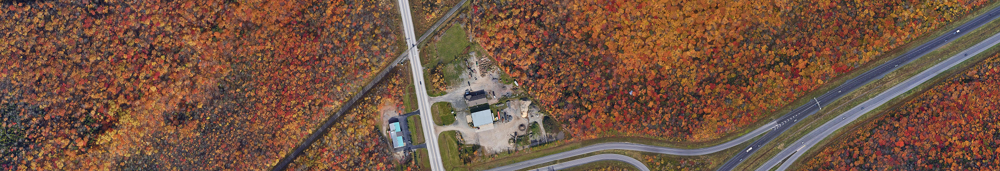
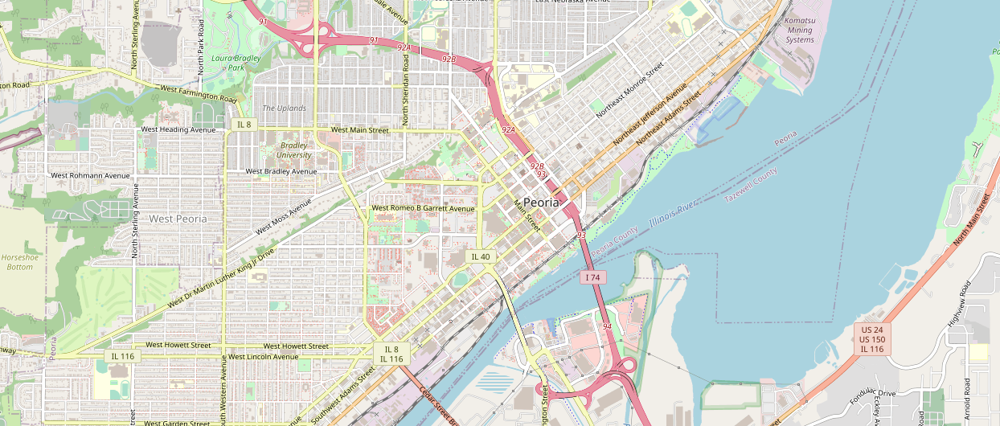

# Get Satellite Imagery by Geographic Coordinates

A Python script that downloads the satellite image of a rectangular area by its geographic coordinates.

The script downloads the required map tiles at a specific zoom level and crops border tiles so that the image exactly matches the area. Works perfectly with Google Maps.

Images are saved as PNG.


<sub><sub>© 2023 Google<sub><sub>

## Usage

Install the required packages.<br>
```cmd
pip install -r requirements.txt
```
Run `main.py`.

On the first run, the script will create a JSON preferences file.

### Preferences file
* `"url"` is the url template that the script will use to get map tiles. The default url may no longer work. In that case, you would need to obtain a new one.
* `"dir"` is the directory where the new images will be saved.
* `"tl"` and `"br"` are the coordinates (decimal degrees, e.g. <nobr>`"40.612123, -73.895381"`</nobr>) of the top-left and bottom-right corners of the area. Leave these empty to enter the coordinates in the terminal.
* `"zoom"` is the zoom level. At each zoom level, there are four times as many 256x256 tiles in a part of the map as at the previous zoom level.
* `"headers"` are the headers that the script will use to make HTTP requests.

### Map Tile URL
To get a tile url, you need to inspect network activity. Most web browsers have developer tools that allow you to do this.

If you are using Google Chrome, open DevTools (Ctrl+Shift+J) and go to the Network panel, which shows all the resources that are being downloaded and uploaded by the browser.



Open Google Maps and switch to satellite view. In the Network panel, find a tile, double click on it, copy the url and replace its x, y and z values with `{x}`, `{y}` and `{z}`. You should get something like this: `https://khms0.google.com/kh/v=937?x={x}&y={y}&z={z}`.

You can also just change the `v=` in the default url template.

---
## Examples

Example images in high resolution: [/img/examples/full_res/](/img/examples/full_res/)


<sub><sub>© 2022 Google<sub><sub>
<br><br>


<sub><sub>© 2022 Google<sub><sub>
<br><br>


<sub><sub>© 2022 Google<sub><sub>
<br><br>


<sub><sub>© 2023 Google<sub><sub>
